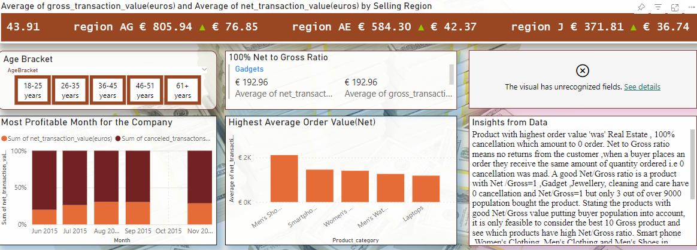
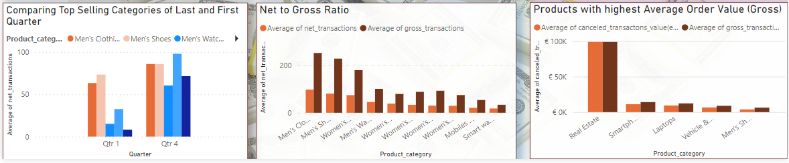
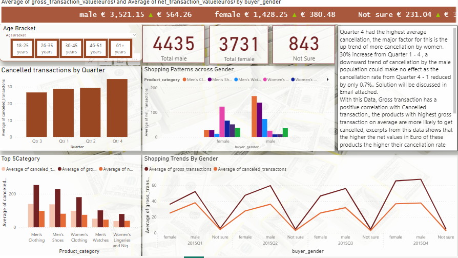
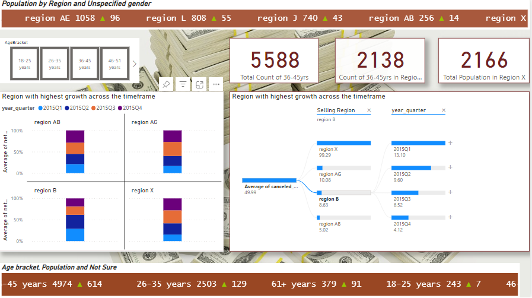

# Commercial-Analyst

# __Disclaimer__  

This project analyzes data from a fictional company,AY. AY has a plethora of products, shoppers cancel orders from AY, this project outlines the problems and solutions to ensure AY makes profit.

**<ins>Problem Statement</ins>**

Over 75% of transactions by consumers of company AY's products are cancelled, the company struggles to maximize the sale of its 97 categories of products leading to consistent business losses which may force the company into Bankruptcy. This analysis traces the trends in consumer behaviour and buying, to profer a solution to increasing sales retention across age groups and regions.

**<ins> Background </ins>:**
Company AY sells to 5 age groups of adults from age 18 to over 61, AY has 97 products line, all products selling in 36 regions, the data shows details of sales to each age group in various regions as well as the gross transactions and net transaction from each class of consumer.

**<ins>Insights From Data </ins>**

The product with the highest order value 'was' Real Estate, 100% cancellation which amounts to 0 orders. Net to Gross ratio means no returns from the customer, when a buyer places an order they receive the same amount of quantity ordered i.e 0 cancellations were made. A good Net/Gross ratio is a product with Net /Gross=1, Gadget, Jewellery, cleaning, and care have 0 cancellations and Net/Gross=1 but only 3 out of over 9000 population bought the product. Stating the products with good Net/Gross value putting buyer population into account, it is only feasible to consider the best 10 Gross products and see which products have a high Net/Gross ratio. Smartphones, Women's Clothing, Men's Clothing and Men's Shoes in descending order(45%,41%, and 40%&36% respectively). Ideally for profit maximization, the Net/Gross ratio will have a positive correlation with buyer population but the opposite is seen in this data given, the reason being that the buying population for all best-selling products is in age group 36-45 years old.

**Trends Across Gender**
Men’s clothing had the highest Average cancelled transactions at 139.44, 272.39% higher than women’s lingerie and nightwear which had an Average cancelled trans of 37.44.
Gross trans Female trend line 36.08 starting Q1, slow growth 47 Q2, Q3 65 trended downwards towards Q4,51, Cancellation for female trended up from 25 on average in Q1 to 36 on average in Q4, Net trans generally trended downwards.
Net transactions for male trended upwards from Q1 51 to 64 in Q4
Cancellation for male trended down from 37.87 on average for q1 to 37.59 on average for Q4.
Gross transactions for men trended upwards.
More male in the general population than females. More males buy men-specific products, and more females buy women-specific products.

Quarter 4 had the highest average cancellation, the major factor for this is the up trend of more cancellations by women. 30% increase from Quarter 1 - 4, a downward trend of cancellation by the male population could make no effect as the cancellation rate from Quarter 4 - 1 reduced by only 0.7%. The solution will be discussed in the Email attached. 
With this Data, the Gross transaction has a positive correlation with Cancelled transactions, the products with the highest gross transaction on average are more likely to get cancelled, excerpts from this data show that the higher the net values in Euro of these products the higher their cancellation rate (men shoes, smartphones, women's clothing, men's watches, women watches& women shoes). Periodic discounts will help drive down the cancellation rate of these products since the more expensive products have a higher average cancellation rate than the less pricey ones.

**Trends Across Age Groups**
18-25: females buying beverages, boy fashion and body baths, and both genders buying smartphones. Males in this age group shop for shoes, 80% cancellation, and men buying women's watches 70% cancellation. 250 of 9009 population. Region A has the highest no of females 18-25
26-35: More males shop for women’s jewelry, décor, fitness, and nutrition. 2632 of the population.
36-45 Region X = 839, AG =400, AE, AB, Y, over half of the population 
46-51: both genders did very little shopping men are shopping for baby products, books, and personal care.
Women – skincare, a team sport. Only 69 of the population.
61+: only 4 women in region AH, 370 men in region AG. 

**<ins>Practical Solution And Recommendations:</ins>**

**Proposed Solutions:**
Commercializing love and relationships, using famous couples as brand ambassadors, Billboards, movies, and date night promotions across products that are gender specific
Couple-oriented products i.e. matching watch set, shoe set for him &her at more discounted rate compared to single products, at a more discounted price.1
Making products age-proof products so the products can be patronized across all adult groups.
Electronics /gadgets like laptops, smartphones, Storage devices, tablets and mobile devices market can be improved by online and social media adds using younger and older generation mix as influencers to enhance the overall gender of the products to make them age-proof.

**Newsletter:**
The major buying population from the data is  age 36-45yrs, Newsletter should be sent to the female age group 36-45years old in region X  since the net transaction for women this group is trended down and that of men is trending upwards, the top 5 selling product will be the target and the major focus/context of the NL will be on the emotion of love and relationship goals.
Does this mean we don’t want single people to buy products from company AY? No, the marketing department will structure the ads in a way that promotes independence, and singlehood but just emphasizes that sharing is caring.

